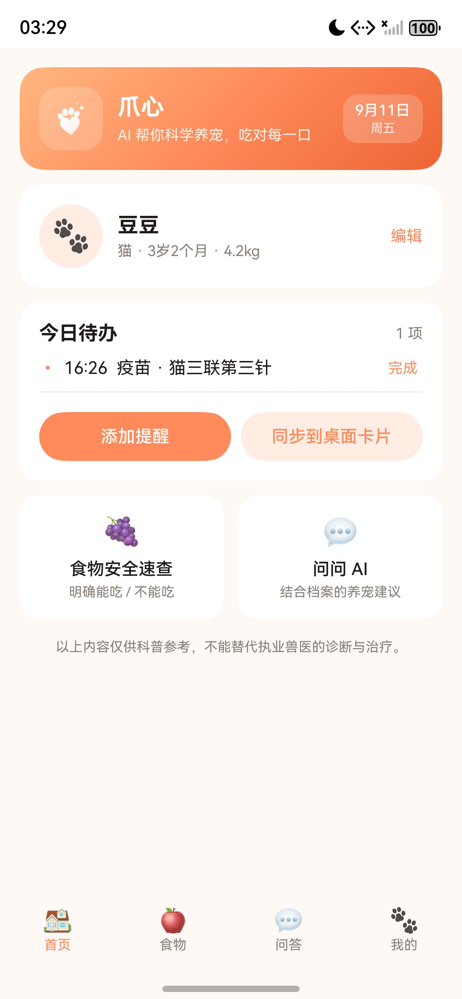
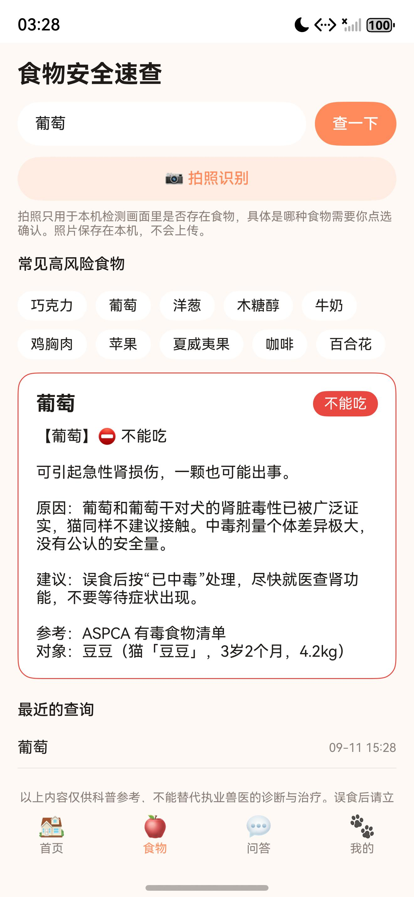
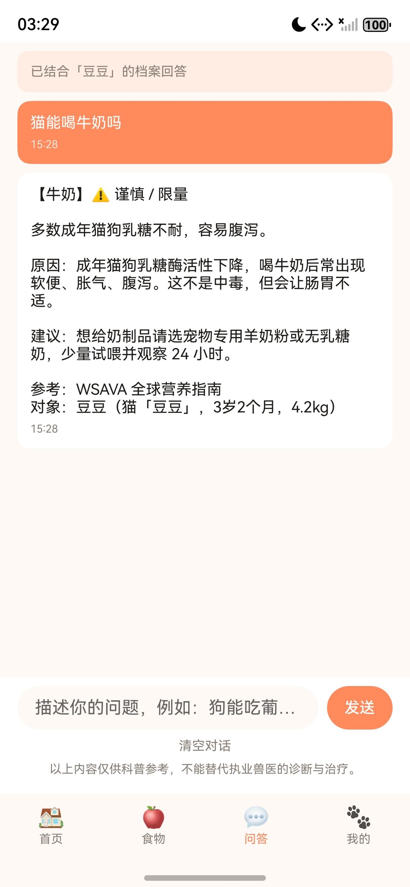
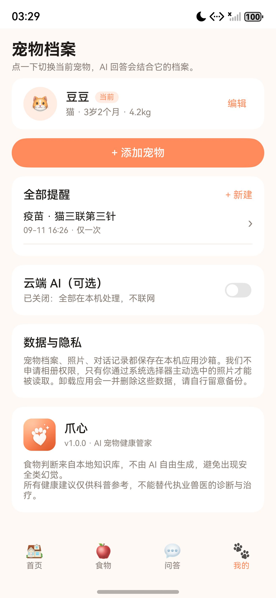

# 爪心（PetHome）

[](https://github.com/Apollo465/pethome/actions/workflows/checks.yml)

> **v1.0.0 登录门禁（2026-09-15 追加）**：按审核意见 6，应用改为**必须先登录华为账号才能使用**：
> 启动进入 `pages/Index.ets` 的登录门禁页，`service/AuthService.ets` 用 Account Kit 完成华为账号登录
> （华为账号是实名账号，登录即完成真实身份核验），未登录不进主界面；
> 「我的」提供退出登录与注销账号。上线前需要在 AGC 开通「华为账号」服务、配置签名证书指纹，
> 必要时按 `module.json5` 里的注释补 `client_id`。
> 连带影响：应用不再是"单机应用"，AGC 备案信息要按实际情况填写并完成 APP 备案。

鸿蒙原生宠物健康管家。当前是可运行的 v1.0 雏形，包含宠物档案、养宠问答、食物安全速查、日程提醒 + 桌面卡片四个模块。

> **v1.0.1（2026-09-18）修复两条审核意见「功能异常」**：
> ① 新建提醒保存时提示"系统提醒注册失败"——根因是日历提醒设了 `snoozeTimes` 却没设配套的
> `timeInterval`（规格要求最少 30 秒），系统按参数错误（1700007）拒绝，旧代码把它落进了兜底文案；
> 现在补齐参数、注册前建通知渠道、送系统前把时间换算成将来时间、失败自动用精简参数重试，
> 并且**先落库再注册**（提醒一定进「今日待办」），页面不再弹失败弹窗，改为提示 +「去开启通知 / 重试注册」；
> 「我的 → 提醒与通知」可一键检查并修复。
> ② 拍照识别提示"图像检测暂不可用"——端侧目标检测是否可用取决于机型与系统版本，
> 现在它只作为提示：照片缩放后送检、失败自动重试，**选完照片直接进入"点选确认食物 → 本地知识库出结论"**，
> 任何机型都能走通。详见 `design/store/审核回复-2026-09-18-功能异常.md`。

> ⚠️ **v1.0.0 上架合规改造（2026-09-15）**：第一次提审被驳回 7 条，其中 4 条指向"应用含 AI 生成服务"。
> 个人开发者拿不到《安全评估报告》与生成式 AI 备案，因此本版本删除了「云端 AI」功能与网络权限，
> 问答改为**纯本地知识库**（预置文案，不接入任何生成式模型），应用成为不联网的单机应用；
> 同时删除了自建的隐私同意弹窗（改由平台隐私声明托管服务弹）。详情见 `design/store/上架进度与待办.md`。

> 名字从「小鸿宠物」改成了「爪心」，取"爪印 + 心形掌垫"，与图标一一对应（应用市场重名与商标排查见 `design/app-icon/README.md`）。
> 工程目录、包名 `com.pethome.xiaohong`、preferences 库名 `pethome_store` 都保持不变——它们不对用户可见，改动会导致已安装的包变成另一个应用、老数据读不到。

<div>
  
  
  
  
</div>

> 界面截图见 [`design/store/shots/`](design/store/shots)，图标源文件见 [`design/app-icon/`](design/app-icon)，上架素材见 [`design/store/`](design/store)。

## 环境

| 项目 | 版本 |
| --- | --- |
| DevEco Studio | 6.0.2.670 |
| HarmonyOS SDK | API 22（6.0.2.130） |
| hvigor / ohpm | 6.22.9 / 6.0.1 |
| 语言 | ArkTS + ArkUI 声明式，Stage 模型 |
| bundleName | com.pethome.xiaohong |

## 用 DevEco 打开并运行

1. DevEco Studio → Open → 选择本目录（`D:\dev\pethome`）。
2. 首次打开会自动 Sync（生成 `oh_modules`、`hvigor-wrapper.js` 等）。
3. 登录华为账号 → File → Project Structure → Signing Configs → 勾选 **Automatically generate signature**，SDK 选 API 22。这一步会往 `build-profile.json5` 写入 `signingConfigs`，没有它无法装到真机。
4. 连接真机（开启开发者模式 + USB 调试），选择 `entry` 模块点运行。

命令行构建（用于 CI 或快速验证，不做签名）：

```powershell
$env:NODE_HOME="C:\Program Files\Huawei\DevEco Studio\tools\node"
$env:DEVECO_SDK_HOME="C:\Program Files\Huawei\DevEco Studio\sdk"
$env:JAVA_HOME="C:\Program Files\Huawei\DevEco Studio\jbr"
$env:Path="C:\Program Files\Huawei\DevEco Studio\tools\node;C:\Program Files\Huawei\DevEco Studio\jbr\bin;"+$env:Path
Set-Location D:\dev\pethome
& "C:\Program Files\Huawei\DevEco Studio\tools\hvigor\bin\hvigorw.bat" assembleHap --mode module -p product=default -p buildMode=debug --no-daemon
```

产物：`entry/build/default/outputs/default/entry-default-unsigned.hap`（约 670KB）。

## 目录结构

```
entry/src/main/ets/
├── entryability/EntryAbility.ets         应用入口，初始化存储与应用级状态
├── entryformability/EntryFormAbility.ets 卡片数据提供者
├── widget/pages/WidgetCard.ets           桌面卡片 UI
├── pages/
│   ├── Index.ets                         主 Tab 容器（首页/食物/问答/我的）
│   ├── PetEditPage.ets                   新建 / 编辑宠物档案
│   └── ReminderEditPage.ets              新建 / 编辑提醒
├── view/
│   ├── HomeTab.ets                       今日待办 + 宠物卡 + 快捷入口
│   ├── FoodTab.ets                       食物安全速查 + 拍照检测
│   ├── ChatTab.ets                       养宠问答（本地知识库）
│   └── PetTab.ets                        档案管理 + 隐私与设置
├── service/
│   ├── AnswerService.ets                 问答引擎（纯本地知识库 + 规则，不联网）
│   ├── PrivacyService.ets                平台隐私声明托管服务（撤回同意）
│   ├── ReminderService.ets               系统代理提醒
│   ├── CardService.ets                   卡片快照与刷新
│   ├── PhotoService.ets                  选图、复制进沙箱
│   └── VisionService.ets                 系统视觉能力封装
├── data/
│   ├── PetStore.ets                      本地存储（preferences + JSON）
│   ├── FoodKnowledge.ets                 食物安全知识库（约 70 条）
│   └── CareKnowledge.ets                 养宠科普知识库（27 个话题）
├── model/Models.ets                      数据模型与免责声明
└── common/                               日期工具、应用级状态
```

## 四个模块的实现方式

**宠物档案**：`PetStore` 用 preferences 存 JSON，照片通过系统图片选择器（PhotoViewPicker）选取后复制进应用沙箱 `files/photos/`。走选择器意味着**不需要申请相册权限**。

**养宠问答**：`AnswerService.ask()` 是分层路由，顺序不可调换（**答案全部来自本地知识库的预置文案，不联网、不调用任何模型**）：

1. 命中急诊关键词（误食、抽搐、呼吸困难、尿闭…）→ 直接给"立即就医"话术，不进入推理；
2. 命中食物词典 → 返回知识库里的确定性结论；
3. 命中"需要就诊但不紧急"关键词 → 引导就医 + 给就诊准备清单；
4. 命中科普话题 → 用宠物档案填充模板，回答里带上"你的猫 2岁4个月、4.2kg"；
5. 都不命中 → 明确告诉用户"知识库里没有"，并给出可以怎么问的建议，不编造答案。

页面上会固定标注内容出处（问答页顶部说明 + 每条回答上方的"来源：食物安全知识库（预置内容）"等）。
这是审核意见 2 要求的"内容显式标识"，也是本应用"不涉及 AI 生成合成内容"的证据之一。

**食物安全**：结论 100% 来自 `FoodKnowledge`，由本地规则直接给出。拍照走系统 `objectDetection` 端侧能力，它只能判断"画面里有没有食物"，**不能识别具体是哪种食物**，所以拍照后由用户点选确认，再查知识库。这是刻意设计——安全类判断不能交给概率模型。

**提醒 + 卡片**：提醒用 `reminderAgentManager` 注册为系统代理提醒，App 不需要常驻后台。数据变化后 `CardService.refreshCard()` 主动更新所有桌面卡片实例。

## 安全红线

* 不做诊断、不给药物剂量、不推荐药品品牌
* 急诊关键词命中后不进入任何模型推理
* 食物"能吃 / 不能吃"的结论只来自本地知识库，不由模型推断
* 每条回答下方固定展示免责声明（写在 UI 里，不藏在设置里）

## 隐私设计

* 档案、照片、对话、提醒全部存在本机
* 不申请相册权限，只读用户主动选中的照片
* 只声明"通知 / 代理提醒"一个权限，**不声明网络权限**，应用不具备联网能力
* 首次启动的隐私同意由华为平台隐私声明托管服务负责，应用内保留隐私政策页与撤回同意入口

## 已知限制（下一步要做的）

1. **食物识别还没有真正的食材分类模型**。当前是"本机检测有没有食物 + 用户确认 + 知识库判定"，按计划应在 V1.2 接入端侧小模型，实现拍照直接给出候选食材。
2. **问答的知识面受限于本地知识库**，27 个话题覆盖常见问题，冷门问题会如实回答"知识库里没有"。扩充话题是性价比最高的投入。
   （云端 AI 兜底已在 v1.0.0 合规改造中移除，见文件开头的说明。）
3. **桌面卡片的数据注入需要在真机验证**（`FormBindingData` → 卡片 `LocalStorage`）。模拟器无法完整验证提醒和卡片。
4. **存储用的是 preferences + JSON**，对话记录上限 200 条、识别记录 100 条。数据量上来后应换成 `relationalStore`。
5. 应用图标已换成正式设计（爪心 · 星火），源文件和换方案脚本在 `design/app-icon/`；
   上架前还需要再出一份 216×216 的静态图标和商店截图。
6. 未做多设备（手表 / 智慧屏）与云备份。

## 上架前还要补的

材料与自检清单见 [`design/store/上架清单.md`](design/store/上架清单.md)，文案见 [`design/store/copy.md`](design/store/copy.md)，
隐私政策见 [`design/store/privacy-policy.md`](design/store/privacy-policy.md)（需把【开发者名称】【联系邮箱】替换为真实信息）。

**应用内已完成的合规项**

* 首次启动隐私声明：由华为平台隐私声明托管服务统一弹出并记录同意结果，应用不再自建弹窗（审核意见 4）
* 应用内隐私政策页可随时阅读，并提供「撤回隐私同意并删除本机数据」（撤回后调用平台接口，下次启动重新弹窗）
* 应用内隐私政策页（`pages/PrivacyPage.ets`），内容与上面那份 Markdown 一致
* 「我的 → 清除全部数据」一键删除本机全部数据
* 「我的 → 隐私政策 → 撤回同意并删除本机数据」撤回同意并退回同意页

**仍需你侧完成的**

* 软著（名称须与「爪心」一致）；APP 核准（备案）按"单机 APP"勾选，无需工信部备案
* 发布证书与发布 Profile 签名（当前 `signingConfigs` 为空，产物是 unsigned HAP）
* 隐私政策挂到可公开访问的网址并填入 AGC
* 真机回归：提醒准点性（含系统通知关闭时的引导与重试）、卡片刷新（含未添加卡片时的提示）、修改档案后列表即时刷新、照片选择兼容性、深色模式下的显示

## 排错

* **DevEco 提示 hvigor-wrapper / Sync 失败**：删掉 `hvigor/hvigor-wrapper.js`（当前是官方模板里的空占位文件）后重新 Sync，IDE 会重新生成。
* **命令行报 `spawn java ENOENT`**：没有把 DevEco 自带的 JBR 加到 PATH，按上面命令行构建那段设置 `JAVA_HOME` 即可，不需要单独装 JDK。
* **命令行报 `Installing pnpm... execute failed`**：系统 PATH 里的 Node 版本太新（本机是 v24），把 DevEco 自带的 `tools\node` 放到 PATH 最前面，并设置 `HVIGOR_USER_HOME` 到一个不含空格的路径。

## 在模拟器上运行

当前已创建一台本地模拟器：**nova 16 Pro / HarmonyOS 6.0.2(22)**，镜像位置 `%LOCALAPPDATA%\Huawei\Sdk`，实例位置 `%LOCALAPPDATA%\Huawei\Emulator\deployed`。

启动方式：DevEco → 设备下拉框 → Device Manager → Local Emulator → 点该设备右侧的 ▶。

设备起来之后，一条命令完成构建 + 安装 + 启动：

```powershell
powershell -ExecutionPolicy Bypass -File D:\dev\pethome\scripts\run-on-emulator.ps1
```

注意：**模拟器可以直接安装未签名的 HAP**，所以本机验证不需要华为账号。真机调试则必须在 DevEco 里配置自动签名（需要登录华为账号）。

## 持续集成

`main` 分支带一个 GitHub Actions（[`checks.yml`](.github/workflows/checks.yml)），跑 [`scripts/ci-check.mjs`](scripts/ci-check.mjs)：

* 所有 `.json` / `.json5` 能否解析（含 `module.json5`、`build-profile.json5`）
* `app.json5` / `module.json5` 的必填字段，以及 `$string:`、`$media:`、`$color:`、`$profile:` 引用能否解析
* `main_pages.json` 里的页面、`form_config.json` 里的卡片页、各 ability 的 `srcEntry` 是否都存在
* `.ets` 里 200 多处 `$r('app.*')` 资源引用是否都能找到
* 多语言 `element/string.json` 的键是否与 `base` 一致
* 合规红线不回退：未声明网络权限、未残留已移除的云端 AI 字段
* 防泄漏：已提交的文件里不能有签名材料（`*.p12` 等）与私钥

本地同样能跑，只用 Node 内置模块，不需要装依赖：

```powershell
node scripts/ci-check.mjs
```

**为什么 CI 里没有 `assembleHap`**：HarmonyOS（非 OpenHarmony）的 SDK 与 hvigor 工具链随 DevEco Studio 分发、需要华为账号登录才能下载，GitHub 托管的 runner 上拿不到，所以公开仓库只能做静态检查。真要验证编译，得在装了 DevEco Studio 的机器上跑 `scripts/build-app.ps1`；工作流里留了自托管 runner 的示例注释，有构建机时可以启用。

## 开源

本仓库以 MIT 协议开源，欢迎 issue / PR。开源范围与注意事项：

* **不包含发布签名材料**：`signing/` 目录（`.p12` 私钥、`.cer`、`.p7b` 以及口令说明）已被 `.gitignore` 排除，自行出正式包请按上文重新生成自己的证书与 Profile。
* **包名与上架信息属于原作者**：`bundleName` 为 `com.pethome.xiaohong`，应用市场素材与应用内 `pages/PrivacyPage.ets` 里的开发者名称、联系邮箱是原作者在 AppGallery 的上架信息，二次开发请替换成自己的，否则无法上架。
* **内容仅作参考**：应用内的食物安全结论与养宠科普全部是预置知识库文案（不联网、不调用模型），不构成诊断或用药建议，二次分发请保留 UI 里的免责声明。

## 许可证

[MIT](LICENSE) © 2026 王宇辉（Wang Yuhui）
